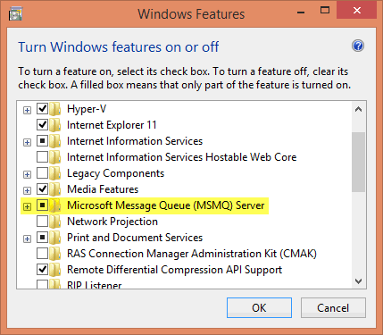

Manufacturing.DataCollector
=======================

A framework for collecting data from a manufacturing facility.

Data is collected in 2 ways:

1. A self-hosted WebAPI in the service able to receive data **pushed to it**.
2. A basic scheduler that uses adapters to **pull** data from virtually anything.

There are a few [simulation datasources](https://github.com/ytechie/Manufacturing.DataCollector/tree/master/Datasources/Simulation) for testing purposes. For example, the *RandomDatasource* generates random data at configurable intervals. The *CPUDatsource* reads CPU usage on a regular interval so that you can collect real-world data from a "sensor" in your computer.

By default, data is stored in a local MS Message Queue, which is available on any Windows machine, and can be configured for high availability with clustering.

## Custom Adapters

Custom adapters can be created for **anything**. Simply implement `IDatasource`. You could create adapters for sensors, historians, or any other source of data.

## Prerequisites

* Since data is stored in a local MSMQ by default, you'll need to have this Windows feature installed. Fortunately, it's available in all editions of Windows. Turn it on in *Add/Remove Programs* under *Windows Features*.

# License

Microsoft Developer Experience & Evangelism

Copyright (c) Microsoft Corporation. All rights reserved.

THIS CODE AND INFORMATION ARE PROVIDED "AS IS" WITHOUT WARRANTY OF ANY KIND, EITHER EXPRESSED OR IMPLIED, INCLUDING BUT NOT LIMITED TO THE IMPLIED WARRANTIES OF MERCHANTABILITY AND/OR FITNESS FOR A PARTICULAR PURPOSE.

The example companies, organizations, products, domain names, e-mail addresses, logos, people, places, and events depicted herein are fictitious. No association with any real company, organization, product, domain name, email address, logo, person, places, or events is intended or should be inferred.
